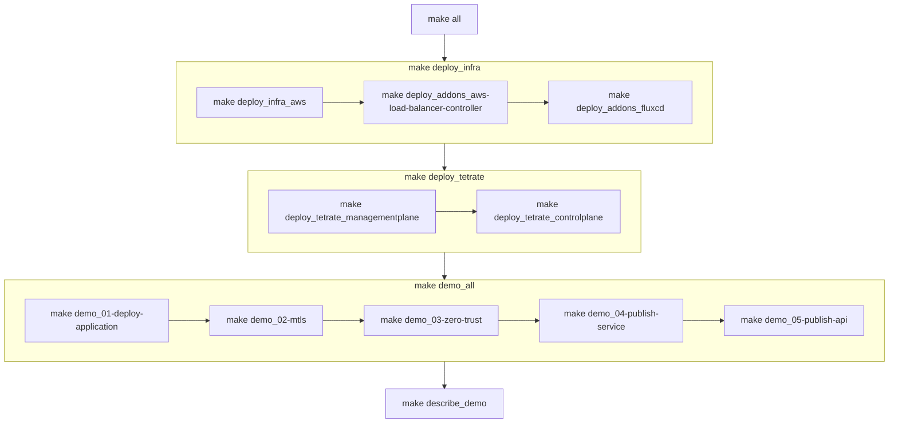

# Tetrate Service Express Sandbox

### Deploy Tetrate Service Express Demo Environment on AWS Elastic Kubernetes Service using Terraform

---

## About

The intention is to create a go-to demo from deploying underlying infra environment to deploying Tetrate Service Express and additional addons around the application use-cases.

## Overview

The `Makefile` in this directory provides ability to fast-forward to any point of the automated provisioning of the demo



# Getting Started

## Prerequisites

- terraform >= 1.5.0
- k8s >= 1.24
- AWS role configured and assumed for terraform to deploy 
## Setup

1. Clone the repo

```bash
git clone https://github.com/tetrateio/tetrate-service-express-sandbox.git
```

2. Copy `terraform.tfvars.json.sample` to the root directory as `terraform.tfvars.json`

```json
{
    "name_prefix": "<YOUR UNIQUE PREFIX NAME TO BE CREATED>",
    "tetrate": {
        "version": "1.7.0+tse",
        "image_sync_username": "<TETRATE_REPO_USERNAME>",
        "image_sync_apikey": "<TETRATE_REPO_APIKEY>"
    },
    "k8s_clusters": {
        "aws": [
        {
            "name": "demo1",
            "region": "us-west-1",
            "version": "1.24"
        },
        {
            "name": "demo2",
            "region": "us-west-1",
            "version": "1.24"
        } 
    ]
    }
}
```

## Usage

All `Make` commands should be executed from root of repo as this is where the `Makefile` is.

### Deploy the complete demo stack

```bash
# Build full demo
make all
```

### Decouple demo deployment in stages

```bash
# Setup underlying clusters, registries, jumpboxes
make deploy_infra

# Deploy Tetrate Service Express Management Plane
make deploy_tetrate_managementplane

# Onboard deployed clusters
make deploy_tetrate_controlplane

# Describe the complete demo stack
make describe_demo

# Deploy the demo application
make demo_01-deploy-application

# Lunch the mTLS demo
make demo_02-mtls

# Lunch the Zero Trust demo
make demo_03-zero-trust

# Lunch the Service Publishing demo
make demo_04-publish-service

# Lunch the API Publishing demo
make demo_05-publish-api

# Fast-forward - Setup all demos
make demo_all
```


The completion of the above steps will result in:

- all the generated outputs will be provided under `./outputs` folder
- output kubeconfig files for all the created aks clusters in format of: $cluster_name-kubeconfig
- output IP address and private key for the jumpbox (ssh username: tetrate-admin), using shell scripts login to the jumpbox, for example to reach gcp jumpbox just run the script `ssh-to-gcp-jumpbox.sh`

### Application Scenarios and Use Cases

* [FluxCD GitOps](./addons/README.md#fluxcd)

## Destroy

When you are done with the environment, you can destroy it by running:

```bash
make destroy
```

For a quicker destroy for development purposes, you can:

- manually delete the clusters via CLI or web consoles
- run `make destroy_local` to delete the terraform data

### Usage notes

- Terraform destroys only the resources it created (`make destroy`)
- Terraform stores the `state` across workspaces in different folders locally
- Cleanup of aws objects created by K8s load balancer services (ELB+SGs) is automated, however based on AWS API timeouts it may require manual cleanup


### Repository structure

| Directory | Description |
| --------- | ----------- |
| [infra](infra) | Infrastructure deployment modules. Provisioning of networking, jumpboxes and k8s clusters. |
| [tetrate](tetrate) | Tetrate terraform modules to deploy Tetrate Service Express. |
| [addons](addons) | Terraform modules to deploy addons such as FluxCD, etc. |
| [modules](modules) | Generic and reusable terraform modules. These should not contain any specific configuration. |
| [make](make) | Makefile helpers. |
| [outputs](outputs) | Terraform output values for the provisioned modules. |
