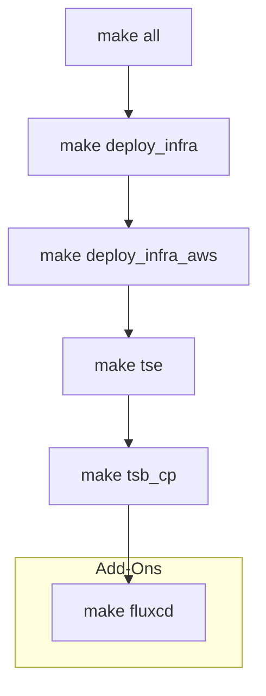

# Tetrate Service Express Sandbox

### Deploy Tetrate Service Express Demo Environment on AWS Elastic Kubernetes Service using Terraform

---

## About

The intention is to create a go-to demo from deploying underlying infra environment to deploying Tetrate Service Express and additional addons around the application use-cases.

## Overview

The `Makefile` in this directory provides ability to fast-forward to any point of the automated provisioning of the TSB demo



# Getting Started

## Prerequisites

- terraform >= 1.5.0
- AWS role configured and assumed for terraform to deploy 
## Setup

1. Clone the repo

```bash
git clone https://github.com/smarunich/tetrate-service-express-sandbox.git
```

2. Copy `terraform.tfvars.json.sample` to the root directory as `terraform.tfvars.json`

```json
{
    "name_prefix": "<YOUR UNIQUE PREFIX NAME TO BE CREATED>",
    "tetrate": {
        "fqdn": "<YOUR UNIQUE PREFIX NAME TO BE CREATED>.aws-ce.sandbox.tetrate.io",
        "version": "1.7.0",
        "image_sync_username": "<TETRATE_REPO_USERNAME>",
        "image_sync_apikey": "<TETRATE_REPO_APIKEY>",
        "password": "Tetrate123"
    },
    "k8s_clusters": {
        "aws": [
        {
            "name": "demo1",
            "region": "us-west-1",
            "version": "1.23"
        },
        {
            "name": "demo2",
            "region": "us-west-1",
            "version": "1.23"
        } 
    ]
    }
}
```

## Usage

All `Make` commands should be executed from root of repo as this is where the `Makefile` is.

1. a) Stand up full demo

```bash
# Build full demo
make all
```

1. b) Decouple demo/Deploy in stages

```bash
# setup underlying clusters, registries, jumpboxes
make k8s

# deploy tsb management plane
make tsb_mp

# onboard deployed clusters (dataplane/controlplane)
make tsb_cp
```

The completion of the above steps will result in:

- all the generated outputs will be provided under `./outputs` folder
- output kubeconfig files for all the created aks clusters in format of: $cluster_name-kubeconfig
- output IP address and private key for the jumpbox (ssh username: tsbadmin), using shell scripts login to the jumpbox, for example to reach gcp jumpbox just run the script `ssh-to-gcp-jumpbox.sh`

## Deployment Scenarios

TBD

## Use Cases and Addons

* [FluxCD GitOps](./addons/README.md#fluxcd)

## Destroy

When you are done with the environment, you can destroy it by running:

```bash
make destroy
```

For a quicker destroy for development purposes, you can:

- manually delete the clusters via CLI or web consoles
- run `make destroy_local` to delete the terraform data

## Usage notes

- Terraform destroys only the resources it created (`make destroy`)
- Terraform stores the `state` across workspaces in different folders locally
- Cleanup of aws objects created by K8s load balancer services (ELB+SGs) is automated, however based on AWS API timeouts it may require manual cleanup

### Repository structure

| Directory | Description |
| --------- | ----------- |
| [addons](addons) | Terraform modules to deploy optional add-ons such as ArgoCD or the TSB monitoring stack. |
| [infra](infra) | Infrastructure deployment modules. Provisioning of networking, jumpboxes and k8s clusters. |
| [make](make) | Makefile helpers. |
| [modules](modules) | Generic and reusable terraform modules. These should not contain any specific configuration. |
| [outputs](outputs) | Terraform output values for the provisioned modules. |
| [tetrate](tetrate) | TSB Terraform modules to deploy the TSB MP and TSB CPs. |
